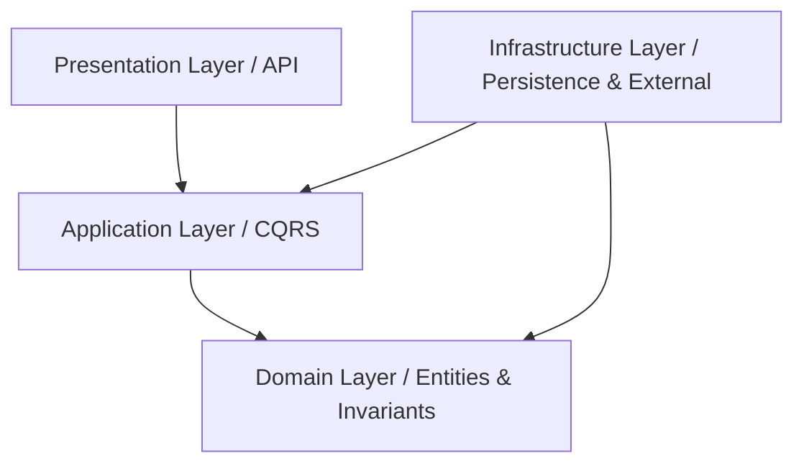

# 📋 Track Application System — Enterprise Job Portal API

> **EraaSoft Backend Advanced Task**  
> A production-ready, scalable, and secure RESTful Web API built with **.NET 10**, **ASP.NET Core Web API**, and **EF Core 10**, strictly adhering to **Clean Architecture**, **CQRS with MediatR**, and modern software engineering best practices.

---

## 🚀 Key Features by Phase

### 🏢 Phase 1: Company & Recruiter Management
- **Company Lifecycle & Approval Workflow**:
  - Companies submit a registration request with status `Pending`.
  - Admins inspect pending company applications and can either `Approve` or `Reject` them.
  - Only recruiters belonging to an `Approved` company can publish job vacancies.
- **Recruiter Organization & Roles**:
  - The creator of an approved company becomes a `CompanyAdmin`.
  - Company Admins can invite/register additional recruiters to represent their company.
  - Multi-tenant data segregation ensuring recruiters can only modify and manage jobs and candidates belonging to their own organization.

### ☁️ Phase 2: Cloud File Handling & Asynchronous Background Notifications
- **Cloudinary CV Storage**:
  - Application-level file storage abstraction (`IFileStorageService`) implemented via **Cloudinary API**.
  - Direct candidate CV upload supporting PDF, DOC, and DOCX files up to 5 MB (`POST /api/candidates/{id}/cv`).
  - Automatic replacement and cleanup of obsolete files from Cloudinary upon re-upload or candidate account deletion.
- **Background Jobs & Email Notifications**:
  - Asynchronous, non-blocking background queue powered by **Hangfire** backed by SQL Server persistence.
  - Email notification engine built on **MailKit** (`IEmailService`) dispatching HTML notifications for:
    - **Candidate Confirmation**: When a job application is successfully submitted.
    - **Recruiter Alerts**: When a candidate applies for their job opening.
    - **Status Updates**: When an application transitions between review stages (`UnderReview`, `InterView`, `Accepted`, `Rejected`).
    - **Company Decision**: When an administrator approves or rejects a company registration.

### ⚡ Phase 3: Performance, Caching, Rate Limiting & Enterprise Hardening
- **Server-Side Pagination, Filtering & Sorting**:
  - Database-level paging for `GET /api/jobs` via `IQueryable`, `CountAsync`, `Skip`, and `Take`.
  - Dynamic filtering by search keyword (title & description), company ID, and active status.
  - Dynamic sorting by creation date, job title, and company name with configurable directions (`asc`/`desc`).
- **Distributed Redis Caching**:
  - High-performance caching abstraction (`ICacheService`) backed by **Redis** (StackExchange.Redis).
  - Cache keys uniquely fingerprint every permutation of pagination, filter, and sorting parameters.
  - Intelligent, non-blocking cache invalidation using Redis `SCAN` (`RemoveByPrefixAsync("jobs:*")`) upon any job mutation (create, update, close, delete).
  - Resilient fallback mechanism: API seamlessly queries SQL Server if Redis is offline.
- **Security & Rate Limiting**:
  - Built-in ASP.NET Core Rate Limiter (`AuthPolicy`: Fixed Window, 10 requests/min) guarding authentication and registration routes against brute-force attacks.
  - RFC 7807 Standardized `ProblemDetails` and centralized `GlobalExceptionHandler`.
- **Database Optimization & Unique Constraints**:
  - Unique composite index `[CandidateId, JobId]` preventing race-condition duplicate applications.
  - Specialized performance indexes on high-traffic query columns (`Jobs.IsActive`, `Jobs.CreatedAt`, `Company.Status`, `AuditLog.CreatedAt`).
- **Comprehensive Audit Trail**:
  - Enterprise `AuditLog` domain entity capturing system actions: user ID, action type, entity name, entity ID, metadata snapshots, client IP address, and timestamps.
  - Zero redundant logging; decoupled and fail-safe execution.

---

## 🏗️ Clean Architecture Overview

The solution strictly enforces the dependency rule (`API -> Application -> Infrastructure -> Domain`):

```
├── Domain               # Core Enterprise Logic (Entities, Enums, Domain Exceptions)
├── Application          # Use Cases & Application Logic (CQRS Commands, Queries, DTOs, Interfaces)
├── InfraStructure       # External Integrations (EF Core, SQL Server, Redis, Hangfire, MailKit, Cloudinary)
└── Api                  # Presentation Layer (Controllers, Middlewares, Rate Limiting, OpenAPI)
```



---

## 🔒 Security & Role-Based Authorization Matrix

| Role | Company Management | Job Management | Candidate Management | Application Management |
|---|---|---|---|---|
| **Admin** | Approve/Reject companies, view all companies | View, Create, and Delete any job | View all candidates, delete candidate profiles | View all applications system-wide |
| **CompanyAdmin** | Register company, invite recruiters to company | Create, edit, and close jobs for their company | View candidates applied to company jobs | Review, update status, view applications for company jobs |
| **Recruiter** | View colleagues in their company | Create, edit, and close jobs for their company | View candidates applied to company jobs | Review, update status, view applications for company jobs |
| **Candidate** | Browse approved companies | Browse active jobs (with pagination & search) | Self-service profile edit, CV upload/delete | Apply to jobs, view own applications, cancel pending applications |

---

## 📡 API Endpoints Reference

### 🔐 Authentication (`/api/auth`)
| Method | Route | Access | Description |
|---|---|---|---|
| `POST` | `/api/auth/register` | Public (Rate Limited) | Register a new user (`Candidate` or `Recruiter`) |
| `POST` | `/api/auth/login` | Public (Rate Limited) | Authenticate user and receive signed JWT token |

### 🏢 Companies (`/api/companies`)
| Method | Route | Access | Description |
|---|---|---|---|
| `POST` | `/api/companies/register` | Public (Rate Limited) | Register a company with recruiter profile (Starts as `Pending`) |
| `GET` | `/api/companies` | `Admin` | Get all companies (optional filter: `?status=Pending`) |
| `GET` | `/api/companies/pending` | `Admin` | Get all pending companies awaiting approval |
| `GET` | `/api/companies/{id}` | Authenticated | Get company profile details by ID |
| `PUT` | `/api/companies/{id}/approve` | `Admin` | Approve company registration and enable job posting |
| `PUT` | `/api/companies/{id}/reject` | `Admin` | Reject company registration |
| `POST` | `/api/companies/recruiters` | `CompanyAdmin`, `Admin` | Add a new recruiter to the current company |
| `GET` | `/api/companies/recruiters` | `Company`, `Recruiter`, `Admin` | Get all recruiters belonging to current company |
| `GET` | `/api/companies/{companyId}/recruiters` | `CompanyAdmin`, `Admin` | Get all recruiters for a specific company |

### 💼 Jobs (`/api/jobs`)
| Method | Route | Access | Description |
|---|---|---|---|
| `GET` | `/api/jobs` | Public | Paginated search & sort (Cached in Redis). Query params: `page`, `pageSize`, `activeOnly`, `search`, `sortBy`, `sortDirection`, `companyId` |
| `GET` | `/api/jobs/{id}` | Public | Get single job details by ID |
| `POST` | `/api/jobs` | `Recruiter`, `Company`, `Admin` | Create job for approved company (Invalidates Redis cache) |
| `PUT` | `/api/jobs/{id}` | Job Creator / `Admin` | Update job title, description, or status (Invalidates Redis cache) |
| `PUT` | `/api/jobs/{id}/close` | Job Creator / `Admin` | Close a job (`IsActive = false`) (Invalidates Redis cache) |
| `DELETE` | `/api/jobs/{id}` | Job Creator / `Admin` | Delete job (Prevented if applications exist) |

### 👤 Candidates (`/api/candidates`)
| Method | Route | Access | Description |
|---|---|---|---|
| `GET` | `/api/candidates` | `Admin` | List all registered candidates |
| `GET` | `/api/candidates/{id}` | Candidate (Owner) / `Admin` | Get candidate profile by ID |
| `PUT` | `/api/candidates/{id}` | Candidate (Owner only) | Update candidate name |
| `POST` | `/api/candidates/{id}/cv` | Candidate (Owner only) | Upload CV document (`multipart/form-data`: PDF/DOC/DOCX, max 5MB) |
| `DELETE` | `/api/candidates/{id}/cv` | Candidate (Owner only) | Delete uploaded CV from Cloudinary and database |
| `DELETE` | `/api/candidates/{id}` | Candidate (Owner) / `Admin` | Delete candidate profile and clean up Cloudinary assets |

### 📄 Job Applications (`/api/applications`)
| Method | Route | Access | Description |
|---|---|---|---|
| `POST` | `/api/applications` | `Candidate` | Apply to active job (`{"jobId": 1}`). Dispatches Hangfire background emails |
| `GET` | `/api/applications/{id}` | Candidate (Owner) / Recruiter / `Admin` | Get application details by ID |
| `GET` | `/api/applications/my` | `Candidate` | List all applications submitted by logged-in candidate |
| `GET` | `/api/applications/job/{jobId}` | Job Creator / `Admin` | List all applications received for a specific job |
| `PUT` | `/api/applications/{id}/status` | Job Creator / `Admin` | Update status (`UnderReview`, `InterView`, `Accepted`, `Rejected`) |
| `DELETE` | `/api/applications/{id}` | Candidate (Owner) | Cancel application (Allowed only if `Applied` or `UnderReview`) |

---

## ⚙️ Configuration & Environment Settings

Update [`Api/appsettings.json`](file:///d:/Eraa%20soft/Api/appsettings.json) with your environment credentials:

```json
{
  "ConnectionStrings": {
    "DefaultConnection": "Server=localhost\\SQLEXPRESS;Database=JobApplicationDb;Trusted_Connection=True;TrustServerCertificate=True"
  },
  "Jwt": {
    "Key": "YourStrongSecretSigningKeyHereWithAtLeast32Characters!",
    "Issuer": "JobApplicationApi",
    "Audience": "JobApplicationUsers",
    "DurationInMinutes": 120
  },
  "Cloudinary": {
    "CloudName": "YOUR_CLOUDINARY_CLOUD_NAME",
    "ApiKey": "YOUR_CLOUDINARY_API_KEY",
    "ApiSecret": "YOUR_CLOUDINARY_API_SECRET"
  },
  "EmailSettings": {
    "SmtpServer": "smtp.gmail.com",
    "Port": 587,
    "SenderName": "Track Application System",
    "SenderEmail": "your-email@gmail.com",
    "Username": "your-email@gmail.com",
    "Password": "your-app-password",
    "UseSsl": false
  },
  "Redis": {
    "ConnectionString": "localhost:6379",
    "DefaultExpirationMinutes": 5,
    "Enabled": true
  }
}
```

---

## 👥 Seeded Test Accounts

The EF Core migration seeds default test accounts out of the box:

| Role | Email | Password | Details |
|---|---|---|---|
| **Admin** | `admin@trackapplication.com` | `Admin@123456` | Full platform administrative privileges |
| **Recruiter** | `recruiter@trackapplication.com` | `Recruiter@123456` | Recruiter linked to pre-seeded Company |
| **Candidate 1** | `ahmed@example.com` | `Candidate@123456` | Ahmed Ali (Pre-seeded Candidate profile) |
| **Candidate 2** | `sara@example.com` | `Candidate@123456` | Sara Mohamed (Pre-seeded Candidate profile) |

---

## 🛠️ Getting Started & Run Instructions

### Prerequisites
- [.NET 10 SDK](https://dotnet.microsoft.com/download/dotnet/10.0)
- SQL Server (LocalDB or SQLEXPRESS)
- Redis Server (Optional: Redis for Windows, WSL2, or Docker container `docker run -p 6379:6379 redis:alpine`)

### 1. Apply Database Migrations
Run the EF Core migration command targeting SQL Server:
```powershell
dotnet ef database update --project InfraStructure --startup-project Api
```

### 2. Run the Application
Start the ASP.NET Core Web API:
```powershell
dotnet run --project Api/JobaApplication.Api.csproj
```

### 3. Explore & Test
- **Interactive Swagger UI**: Open your browser at `https://localhost:5001/swagger` (or `http://localhost:5102/swagger`).
  - Click **Authorize** and input: `Bearer <your_jwt_token>`.
- **Hangfire Dashboard**: Navigate to `/hangfire` to monitor background email processing and retries.
- **Visual Studio / VS Code REST Client**: Use the preconfigured test file [`Api/JobaApplication.Api.http`](file:///d:/Eraa%20soft/Api/JobaApplication.Api.http).

---

## 🛡️ Core Business Invariants Enforced

1. **Approved Company Constraint**: Recruiters can never create jobs under a company that is still in `Pending` or `Rejected` status.
2. **Duplicate Application Prevention**: Candidates cannot submit multiple applications for the same job. Enforced via application logic and a unique database constraint.
3. **Application State Machine**: An application can only be cancelled by the candidate if its status is still `Applied` or `UnderReview`. Once moved to `InterView`, `Accepted`, or `Rejected`, cancellation is rejected by Domain rules.
4. **Historical Data Protection**: A job that already has submitted applications cannot be deleted; it must be closed instead.
5. **Secure Identity Extraction**: All sensitive user references (`CandidateId`, `CompanyId`, `UserId`) are inferred server-side from validated JWT claims, preventing tampering or unauthorized impersonation.
